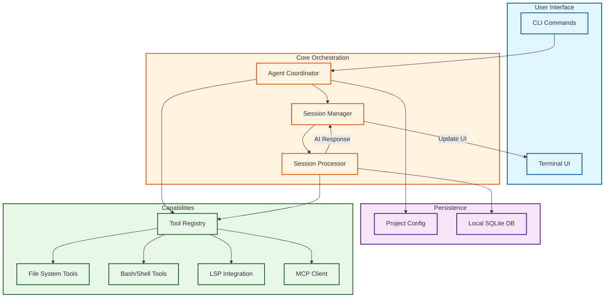

# Vibes System Architecture

This diagram illustrates the core components and data flow of the **Vibes** agentic system, as derived from the provided architectural sketch.

## Architecture Diagram

## Component Breakdown

### User Interface
- **CLI Commands**: The primary entry point for user interactions.
- **Terminal UI**: Dynamic interface for real-time feedback and session updates.

### Core Orchestration
- **Agent Coordinator**: Manages high-level task orchestration and initial setup.
- **Session Manager**: Maintains the state of the current session and handles UI updates.
- **Session Processor**: Executes the logic for individual steps, interacting with AI models and tools.

### Persistence
- **Project Config**: Stores environment-specific settings and workspace configuration.
- **Local SQLite DB**: Persists session history, logs, and long-term memory.

### Capabilities
- **Tool Registry**: A central hub that manages available system tools.
- **System Tools**: Includes file system access, shell execution, LSP integration, and MCP (Model Context Protocol) clients.
